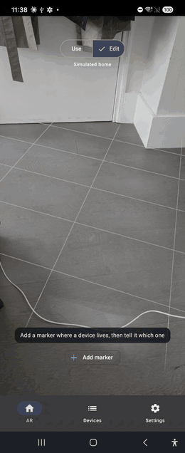
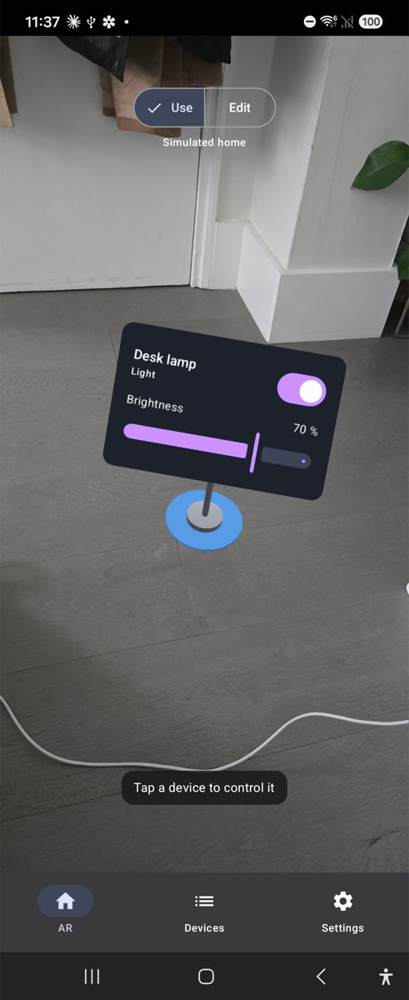
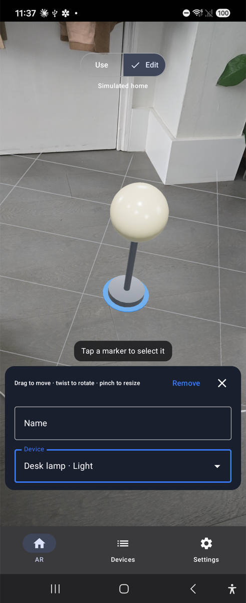
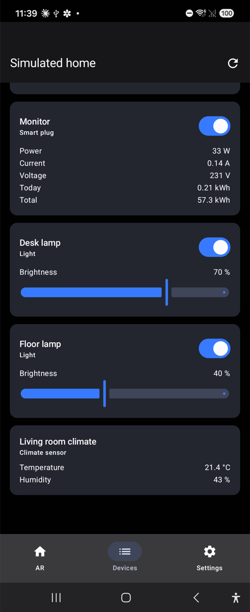
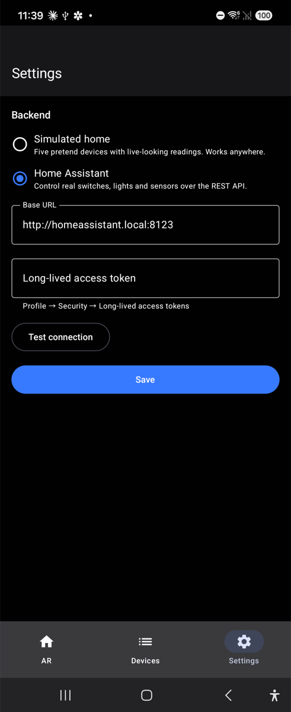

# Deixis — smart-home control by pointing at things

[](https://github.com/jehelmich/deixis/actions/workflows/ci.yml)

<p align="center">
  
  &nbsp;&nbsp;&nbsp;
  
</p>

Point your phone at the room, pin markers where your smart plugs, lights and sensors
actually are, and control them by tapping the thing itself. A card floats in front of each
device with its live readings — power draw, brightness, temperature — and the controls to
change them.

*Deixis* is the linguists' word for reference that only works from where you stand — "this
one", "over there". The idea comes from my Cambridge Computer Science bachelor thesis
(2019): pointing at a device beats finding it in the flat list every smart-home app ends up
with. This is that thesis app rebuilt on the 2026 Android stack — Kotlin, Jetpack Compose,
ARCore via SceneView — plus the one thing the original never had: a **simulated home**, so
it is a working demo without any hardware. The 2019 code is preserved at the tag
[`thesis-2019`](https://github.com/jehelmich/deixis/tree/thesis-2019).

## Try it

Install the APK from the [latest release](https://github.com/jehelmich/deixis/releases) on
any phone with [ARCore support](https://developers.google.com/ar/devices), or build it
(below). It starts against the simulated home, so there is nothing to set up.

<p align="center">
  
  &nbsp;
  
  &nbsp;
  
  &nbsp;
  
</p>

1. **Edit** — tap *Add marker*, then tap a surface. A pin appears; name it and pick which
   device it is. Drag to move, twist to rotate, pinch to resize. Tap another marker to
   select that one instead, tap empty space to deselect.
2. **Use** — tap a device. Its card opens in front of it, facing you, with a switch,
   a brightness slider or the sensor's readings. Tap empty space to close it.
3. **Devices** — the same devices and controls as a plain list. Works on anything,
   including an emulator, and is the quickest way to watch the backend tick.
4. **Settings** — switch to a real [Home Assistant](https://www.home-assistant.io): base
   URL and a long-lived token, *Test connection*, *Save*. Switches, lights and
   temperature/humidity sensors show up; details in
   [docs/home-assistant.md](docs/home-assistant.md).

## What is in it

- **Two backends behind one interface.** `SimulatedSmartHome` ticks plausible readings
  (a kettle draws 2 kW with noise and accumulates kWh; the climate sensor random-walks);
  `HomeAssistantRepository` polls the REST API while anyone is looking and refreshes after
  every command. The UI cannot tell them apart, and the app swaps between them live when
  the settings change.
- **Placement separated from identity.** A marker is an ARCore anchor plus a name and an
  optional device binding. The room can be laid out before the backend is even configured;
  the marker's shape follows the binding — a pin until assigned, then a lamp, a plug or a
  sensor box whose colour reacts to state.
- **Compose in 3D.** The floating cards are ordinary Compose (`DeviceControls`, shared with
  the Devices list) rendered onto a quad by SceneView's `ViewNode`, kept facing the camera,
  placed clear of the device and drawn on top so nothing can cover the controls.
- **Gestures that stick.** ARCore rewrites an anchor's pose every frame, so the anchor
  owns position only and a child node owns rotation and scale. Only the selected marker
  takes gestures, and pinch and twist work from anywhere on the screen.
- **Tests at both ends.** JVM unit tests for the backends, the Home Assistant mapping and
  the HTTP client (against a mock server); one UiAutomator test that places a marker over a
  live ARCore session.

## How it works

```
                 ┌──────────────── UI (Compose) ────────────────┐
                 │  ArScreen        DevicesScreen   SettingsScreen│
                 │  ArViewModel     DevicesViewModel SettingsVM   │
                 └────────┬───────────────┬───────────────┬──────┘
                          │               │               │
   ARCore session ──▶ AnchorNode ──┐      │      ConnectionSettings (DataStore)
   plane hit-test     ├─ body node │      ▼               │
   tap / drag / twist │  (geometry)├─▶ SmartHomeRepository ◀──── AppContainer picks one
                      └─ ViewNode ─┘      ▲         ▲
                        (Compose card     │         │
                         in 3D space) SimulatedSmartHome   HomeAssistantRepository
                                      ticking readings     Ktor ⇄ /api/states, /api/services
```

The AR screen is a [SceneView](https://github.com/sceneview/sceneview) `ARSceneView` over
ARCore and Filament. Each marker is an `AnchorNode` from a plane hit; the body under it
carries primitive geometry, and — when selected in Use mode — a `ViewNode` with the card.
Everything below the UI talks to `SmartHomeRepository`; `AppContainer` builds the graph by
hand. [docs/architecture.md](docs/architecture.md) goes through the node tree, the gesture
routing and the SceneView details worth knowing; [docs/thesis.md](docs/thesis.md) maps the
2019 code onto the rewrite.

## Repository layout

```
app/src/main/kotlin/com/janhelmich/deixis/
  domain/          Device, DeviceState, SmartHomeRepository — no Android in here
  data/simulated/  the pretend home
  data/homeassistant/  REST client, entity → device mapping, polling repository
  data/settings/   backend choice, URL and token, in DataStore
  di/              AppContainer: builds the graph by hand
  ui/ar/           AR screen, view model, procedural geometry, floating card, edit panel
  ui/devices/      flat device list
  ui/settings/     backend settings
  ui/common/       DeviceControls, shared by the AR card and the list
app/src/test/      JVM unit tests
app/src/androidTest/  the on-device placement test
docs/              architecture, Home Assistant setup, thesis notes, images, icon source
.github/workflows  CI on every push; APK attached to releases on v* tags; emulator experiment
```

## Building

JDK 21+ and an Android SDK with platform 37 and build-tools 36. Point Gradle at the SDK
with `local.properties` (`sdk.dir=…`) or `ANDROID_HOME`. No Android Studio needed, though
it opens the project fine.

```sh
./gradlew lintDebug testDebugUnitTest    # what CI runs on every push
./gradlew installDebug                   # onto a connected phone
./gradlew connectedDebugAndroidTest      # the AR placement test, on that phone
```

Stack: Kotlin 2.4 (AGP 9.4 built-in), Compose Material 3, SceneView 4.35 / ARCore 1.56 /
Filament 1.72, Ktor 3.5, DataStore, Navigation with type-safe routes, JVM 21.

## Status

**Working, on hardware.** Everything above has been used on a Galaxy Z Flip6 (Android 16,
ARCore 1.56): placing on floors and desks, naming and binding, selection, drag / twist /
pinch, the floating card and its controls, mode switching, the device list and settings.
The on-device placement test passes there in about twelve seconds; lint, unit tests and
both APK builds are green on every push.

Not yet covered, in order of how much I'd like to:

- **Home Assistant against a live instance.** The client and mapping are unit-tested
  against recorded payloads, not a running HA. Plug power readings expect the attribute
  names the 2019 TP-Link integration used; newer integrations put those on separate
  `sensor.*` entities and the plug card shows "—" for them.
- **Persistence.** Markers live in the view model and survive rotation, not process death.
  ARCore anchors are session-bound; keeping a room between launches means Cloud Anchors or
  a persistence layer, neither of which the thesis had either.
- **The emulator.** ARCore in the Android Emulator's virtual scene would make the AR path
  testable in CI. Not there yet: Emulator 37 on Apple Silicon exposes its camera as ID
  `10` while the arm64 ARCore build looks for `0`, and the x86_64 attempt in
  [`ar-emulator.yml`](.github/workflows/ar-emulator.yml) has not got the emulator online
  under SwiftShader. Manual-only until it does.
- Vertical surfaces and rooms with many markers have had less time than a desk with three.

## Licence

My own work is BSD 2-Clause — see [LICENSE](LICENSE). Everything the build pulls in stays
under its own terms; [THIRD_PARTY.md](THIRD_PARTY.md) lists what and why.
